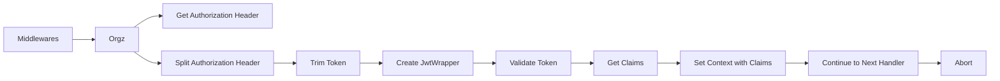

```go

package middlewares

import (
	"go-jwt/auth"
	"strings"

	"github.com/gin-gonic/gin"
)

// Orgz is a middleware that validates token and authorizes users
// It takes a gin.Context as an argument and returns a gin.HandlerFunc
// This function is responsible for validating the token sent by the client in the Authorization header
// and authorizing the user if the token is valid.
func Orgz() gin.HandlerFunc {
 return func(c *gin.Context) {
  // Get the Authorization header from the request
  clientToken := c.Request.Header.Get("Authorization")
  if clientToken == "" {
   // If the Authorization header is not present, return a 403 status code
   c.JSON(403, "No Authorization header provided")
   c.Abort()
   return
  }
  // Split the Authorization header to get the token
  extractedToken := strings.Split(clientToken, "Bearer ")
  if len(extractedToken) == 2 {
   // Trim the token
   clientToken = strings.TrimSpace(extractedToken[1])
  } else {
   // If the token is not in the correct format, return a 400 status code
   c.JSON(400, "Incorrect Format of Authorization Token")
   c.Abort()
   return
  }
  // Create a JwtWrapper with the secret key and issuer
  jwtWrapper := auth.JwtWrapper{
   SecretKey: "verysecretkey",
   Issuer:    "AuthService",
  }
  // Validate the token
  claims, err := jwtWrapper.ValidateToken(clientToken)
  if err != nil {
   // If the token is not valid, return a 401 status code
   c.JSON(401, err.Error())
   c.Abort()
   return
  }
  // Set the claims in the context
  c.Set("email", claims.Email)
  // Continue to the next handler
  c.Next()
 }
}

```


In this overview, the `Middlewares` package is the root of the diagram, representing the package that contains the `Orgz` function.
The `Orgz` function is represented by the `B` node, which takes a `gin.Context` as an argument and returns a `gin.HandlerFunc`.
The `Orgz` function first gets the `Authorization` header from the request using the `C` node.
It then splits the `Authorization` header into two parts using the `D` node, and trims the

```
